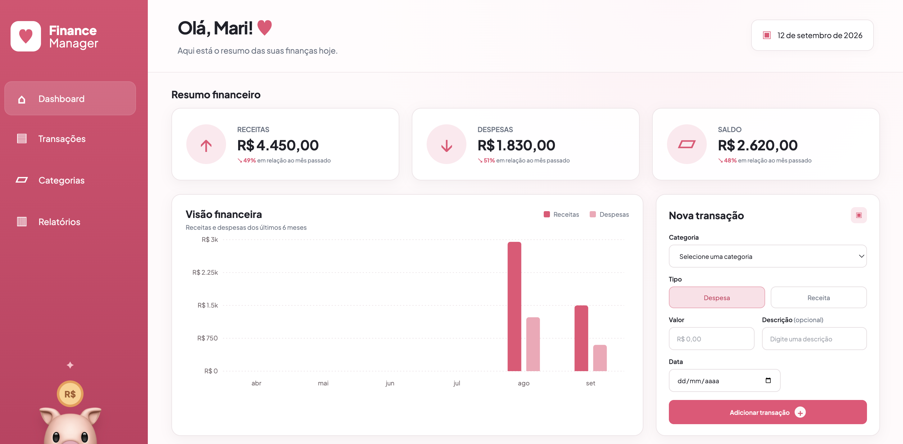
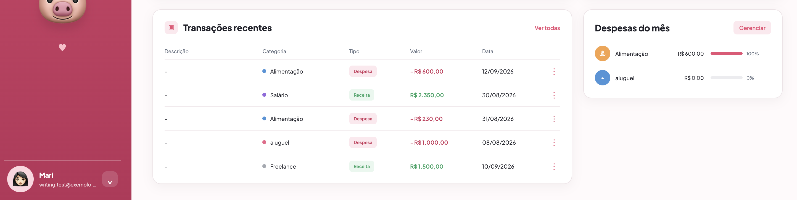
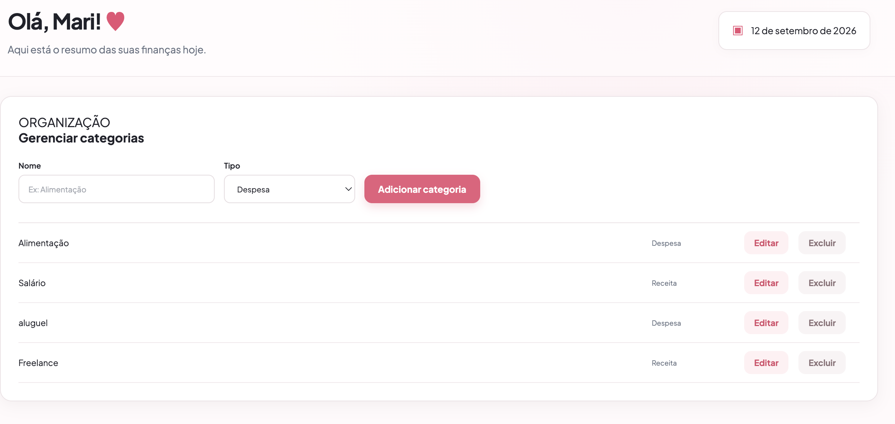

# ♡ Finance Manager

> A simple personal finance workspace for tracking income, expenses, categories, and financial balance.

[](https://mari-ww.github.io/finance-manager/demo/)
[](https://www.python.org/)
[](https://fastapi.tiangolo.com/)
[](https://react.dev/)
[](https://www.postgresql.org/)
[](https://www.docker.com/)

Finance Manager is a full-stack personal finance application designed to make everyday financial organization simple and visual.

The application brings **income, expenses, categories, transactions, and financial summaries** together in one workspace.

The project was built as a portfolio application with a focus on practical full-stack development, REST API design, relational data modeling, authentication, database migrations, automated testing, and a polished React interface.

## What it does

Finance Manager allows users to keep track of their personal finances without relying on spreadsheets or disconnected notes.

Users can:

* Record income and expenses
* Organize transactions by category
* View their current financial balance
* Review recent transactions
* Filter and manage transactions
* Create, edit, and delete categories
* View monthly expense distribution
* Compare financial activity with the previous month

The dashboard provides a visual overview of the user's financial situation, while dedicated pages allow more detailed transaction and category management.

---

## ♡ Features

### ↑ Income & Expenses

Transactions can be registered as either income or expense.

Each transaction contains:

* Description
* Amount
* Date
* Category
* Transaction type

The application automatically uses these transactions to calculate the user's financial totals.

### ▱ Financial Overview

The dashboard provides a quick overview of:

* Total income
* Total expenses
* Current balance
* Monthly changes

The summary compares the current month with the previous month to make changes in financial activity easier to understand.

### ▥ Financial Chart

Financial activity is presented visually through a monthly income and expense chart.

This allows users to quickly identify changes in their financial activity without having to inspect every transaction individually.

### ▤ Transactions

All transactions can be viewed from a dedicated page.

Users can:

* View transaction history
* Add new transactions
* Filter transactions
* Review transaction details

Recent transactions are also displayed directly on the dashboard for quick access.

### ♡ Categories

Categories help organize financial activity.

Users can:

* Create categories
* Edit categories
* Delete categories
* Associate transactions with categories
* View monthly expenses by category

The dashboard displays the categories responsible for the user's expenses during the current month.

### ♡ Authentication

Each user has their own account and financial data.

The application uses JWT authentication to protect authenticated routes and identify the current user.

Passwords are securely hashed before being stored in the database.

---

## Demo

The project includes a static interactive demo so the interface can be explored without running the backend.

**[♡ Open Interactive Demo](https://mari-ww.github.io/finance-manager/demo/)**

> The demo uses fictional data and does not connect to the application's backend.

---

## Preview







---

## ◈ Tech Stack

### Frontend

* React
* JavaScript
* Vite
* CSS

### Backend

* Python
* FastAPI
* SQLAlchemy
* Alembic
* PostgreSQL
* JWT Authentication
* Bcrypt

### Testing & Development

* Pytest
* Docker
* Docker Compose
* Git
* GitHub

---

## How It Works

The frontend and backend communicate through a REST API.

```text
React + JavaScript
        │
        │ REST API
        ▼
     FastAPI
        │
        ▼
   PostgreSQL
```

The backend uses SQLAlchemy to communicate with PostgreSQL and Alembic to manage database migrations.

Authentication is handled through JWT tokens, allowing protected endpoints to identify the currently authenticated user.

### Transaction flow

When a user creates a transaction:

```text
Transaction submitted
        ↓
Validate request
        ↓
Authenticate user
        ↓
Save transaction
        ↓
Associate category
        ↓
Update financial totals
        ↓
Display on dashboard
```

The dashboard then aggregates the stored transactions to calculate income, expenses, balance, monthly comparisons, and category totals.

---

## Project Structure

```text
finance-manager/
│
├── backend/
│   ├── app/
│   │   ├── core/
│   │   ├── db/
│   │   │   ├── models/
│   │   │   └── database.py
│   │   ├── repositories/
│   │   ├── routers/
│   │   └── schemas/
│   │
│   └── tests/
│
├── frontend/
│   └── src/
│       ├── components/
│       ├── pages/
│       ├── styles/
│       └── ...
│
├── demo/
│   ├── index.html
│   ├── demo.js
│   ├── demo.css
│   ├── dash1.png
│   ├── dash2.png
│   └── categ.png
│
├── docker-compose.yml
└── README.md
```

---

## ▶ Running Locally

### Requirements

* Docker
* Docker Compose
* Node.js
* npm

### Clone the repository

```bash
git clone https://github.com/mari-ww/finance-manager.git
cd finance-manager
```

### Start the application

```bash
docker compose up --build
```

This starts the application services using Docker Compose.

FastAPI's interactive API documentation is available at:

```text
/docs
```

---

## ◈ Testing

The backend uses Pytest for automated tests.

Run the tests with:

```bash
pytest
```

The tests cover application behavior including authentication and API functionality.

---

## ⋆ Design

I wanted Finance Manager to feel **simple, soft, and approachable**, rather than like a traditional banking application.

The interface uses:

* Soft pink tones
* Rounded cards
* Light backgrounds
* Subtle borders
* Minimal visual noise
* Clear financial indicators

The goal was to make financial information easy to scan while keeping the interface friendly and personal.

---

## What I Learned

While building Finance Manager, I got to practice:

* Building a REST API with FastAPI
* Implementing JWT authentication
* Secure password hashing with Bcrypt
* Working with PostgreSQL and SQLAlchemy
* Managing database migrations with Alembic
* Building a React + JavaScript frontend
* Connecting a frontend to a backend API
* Designing relational data models
* Implementing CRUD operations
* Writing automated backend tests with Pytest
* Using Docker Compose for development
* Structuring a full-stack application
* Deploying a full-stack project

---

## Author

**Mariana Carneiro**

Computer Science graduate focused on backend and full-stack development.

[GitHub](https://github.com/mari-ww) · [LinkedIn](https://www.linkedin.com/in/mariana-carneiro-573888254/)
